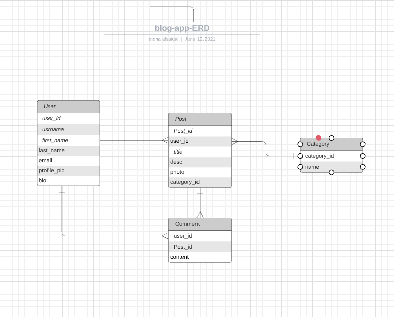

# Description (H3ROES Blog App)
It's simply a Blog application that gathers SEI15 students and allows us to share knowledge, experience and interests in different fields.[Join Us!]()


**Team Members**
* Ahoud kensara
* Mona alsaiqal
* Mona aldawsari


### Important Links:
- [Frontend repo](https://git.generalassemb.ly/alsaiqal/blog-app-frontend2)
- [Deployed API]() 
- [Deployed Client]()


### ER Diagram
* Img: ER Digram For Heroes blog app


## Installation instructions:
```
1. npm i // to install all the packages
2. npm start  // to run the backend
3. Use PostMan to test the api
```
## Future Feachers
* Add new categories by the User
* Add Likes
* Add bio

## Technologies and dependencies we used 
* Visual Studio Code
* MongoDb
* Mongoose
* Node.js
* Express
* multer
* bcryptjs
* cors 
* dotenv
* nodemon

### Catalog of Routes

Verb         |	URI Pattern
------------ | -------------
GET | /blog/v1/posts
GET | /blog/v1/posts/:id
GET | /blog/v1/categories
POST| /blog/v1/posts/create
POST| /blog/v1/upload
POST| /auth/register
POST| /auth/login
POST| /comment/saveComment
PUT | /auth/changePass/:id
PUT | /blog/v1/posts/:id
Delete |  /blog/v1/posts/:id
Delete |  /auth/:id
POST| /comment/saveComment/:id


## Recources
* [Multer to upload files](https://bezkoder.com/node-js-upload-multiple-files/)
* [React Context API](https://www.loginradius.com/blog/async/react-context-api/)